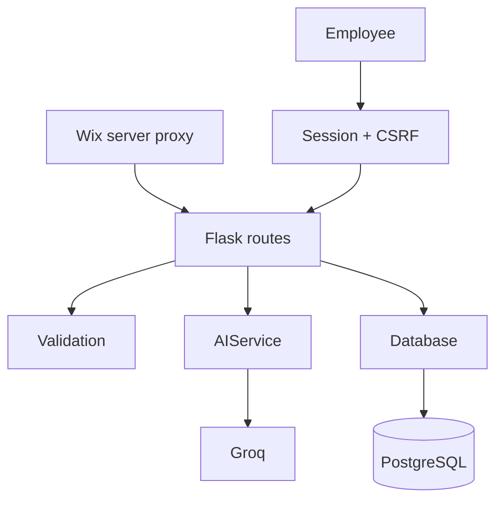

# Backend Mimarisi

## Veri akışı

## Sorumluluk sınırları

| Dosya | Tek sorumluluk | Yasak bağımlılık |
|---|---|---|
| `config.py` | Ortam değişkenleri ve çalışma profilleri | Route, SQL, HTTP isteği |
| `app/validation.py` | API sınırındaki tür/boyut kuralları | Flask response, SQL, AI |
| `app/routes.py` | HTTP koordinasyonu ve güvenli hata eşleme | SQLAlchemy, Groq endpoint'i |
| `app/services/ai_service.py` | Prompt, sağlayıcı ve AI yanıt şeması | Veritabanı, template |
| `app/database.py` | Engine, şema ve bütün veri erişimi | HTTP, AI, session |
| `app/auth.py` | Çalışan session, rol ve CSRF | Lead sorgusu, AI |
| `app/__init__.py` | Application factory ve çapraz güvenlik | İş kuralı |

Bu sınırlar `scripts/architecture_audit.py` ile otomatik olarak kontrol edilir.

## Neden SQLAlchemy Core?

- SQLite ve PostgreSQL aynı veri sözleşmesini kullanır.
- `insert(...).values(...)` ve `select(...)` kullanıcı değerlerini SQL metnine
  eklemek yerine sürücünün bağlı parametrelerine dönüştürür.
- Yönergede istenen `?` parametre korumasının sürücü bağımsız karşılığıdır;
  SQLite bunu `?`, PostgreSQL ise isimli/uygun sürücü placeholder'ı olarak yürütür.
- Tek statik raw sorgu health kontrolündeki kullanıcı girdisi içermeyen
  `SELECT 1` ifadesidir.

## Dil sözleşmesi

Frontend mesajı değiştirmez; `dil: en|tr` alanını backend'e gönderir. AI servis
katmanı dil talimatını sistem mesajına ekler. Böylece kullanıcı metni ile sistem
talimatı birbirine karışmaz ve 2.000 karakter sınırı iki katmanda aynı kalır.
