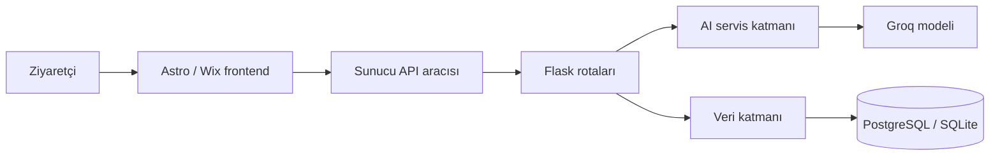

# AESIR AXIOM — Corporate Site & ASGARDIAN Frontend

AESIR AXIOM’un iki dilli kurumsal web arayüzü; mühendislik markasını sunar,
ziyaretçiyi ASGARDIAN yapay zekâ asistanına bağlar ve proje taleplerini güvenli
bir sunucu aracısı üzerinden Flask backend’e iletir.

## Canlı sistem

- Site: https://aesir-axio-b8ecbbfe-simsekerismetefe.wix-site-host.com/
- Backend health: https://aesir-axiom-ai-sales-assistant.onrender.com/health
- Backend repository: https://github.com/simsekerefe/aesir-axiom-ai-sales-assistant
- Teknik jüri görünümü: `/technical-dossier`

## Teknoloji yığını

- Astro 5 + TypeScript
- React islands
- Wix-managed Headless ve Wix SDK
- Wix CMS ve Wix Forms
- CSS/Tailwind v4 tasarım tokenları
- Flask/Render üzerinde ASGARDIAN REST API

## Sistem akışı



Tarayıcı, Render adresini veya gizli yapılandırmayı doğrudan kullanmaz.
`/api/asgardian` ve `/api/leads` rotaları doğrulama, zaman aşımı, güvenli hata
dönüşümü ve backend yönlendirmesinden sorumludur.

## Kaynak yapısı

```text
src/
├── components/       # Navigasyon, footer, form ve React chatbot
├── layouts/          # Ortak HTML, SEO, loader ve sayfa geçişleri
├── lib/              # Tekrar kullanılabilir işlevler
├── pages/            # EN/TR sayfalar ve server API rotaları
├── styles/           # Merkezi tokenlar ve bileşen stilleri
└── utils/            # Analitik, Ricos ve Wix görsel yardımcıları
scripts/              # Teslim/audit kontrolleri
docs/                 # Mimari, frontend, tasarım ve demo açıklamaları
```

## Yerel geliştirme

```bash
npm install
npm run dev
```

Gerekli sunucu değişkenini `.env.local` içinde tanımlayın. Bu dosya Git’e
eklenmez.

```env
ASGARDIAN_BACKEND_URL=https://your-backend.example.com
```

## Doğrulama

```bash
npm run audit
npm run build
# veya ikisi birlikte
npm run verify
```

`audit`, zorunlu sayfaları, tüm çift dilli rotaları, CMS sözleşmesini, API
katmanını, tasarım tokenlarını, teknik dosyaları ve kaynak kodda gizli anahtar
izi bulunmadığını kontrol eder. `build`, Wix’in üretim adaptörüyle
TypeScript/Astro derlemesini kanıtlar.

## Jüri değerlendirmesiyle eşleştirme

| Kriter | Kanıt |
|---|---|
| Mimari / SoC | Frontend sunum, API proxy ve backend iş mantığı ayrı katmanlardadır |
| Çalışırlık | Canlı site, ASGARDIAN, lead formu, dashboard ve `/health` |
| Kod kalitesi | TypeScript tipleri, küçük yardımcı fonksiyonlar, merkezi içerik/CMS planı |
| Güvenlik | Gizli değişkenler sunucuda, girdi sınırları, timeout, no-store yanıtları |
| Hata yönetimi | Proxy ve UI katmanlarında kullanıcı dostu TR/EN hata durumları |
| Yayın / sunum | Wix canlı frontend, Render backend, GitHub kaynak ve teknik dossier |

Detaylar için:

- [Mimari](docs/ARCHITECTURE.md)
- [Frontend açıklaması](docs/FRONTEND.md)
- [Wix CMS içerik modeli](docs/CMS.md)
- [Tasarım sistemi](docs/DESIGN_SYSTEM.md)
- [Jüri demo akışı](docs/JURY_DEMO.md)

## Marka

**AESIR AXIOM — Engineering Intelligence**

*Engineering Beyond the Horizon*
