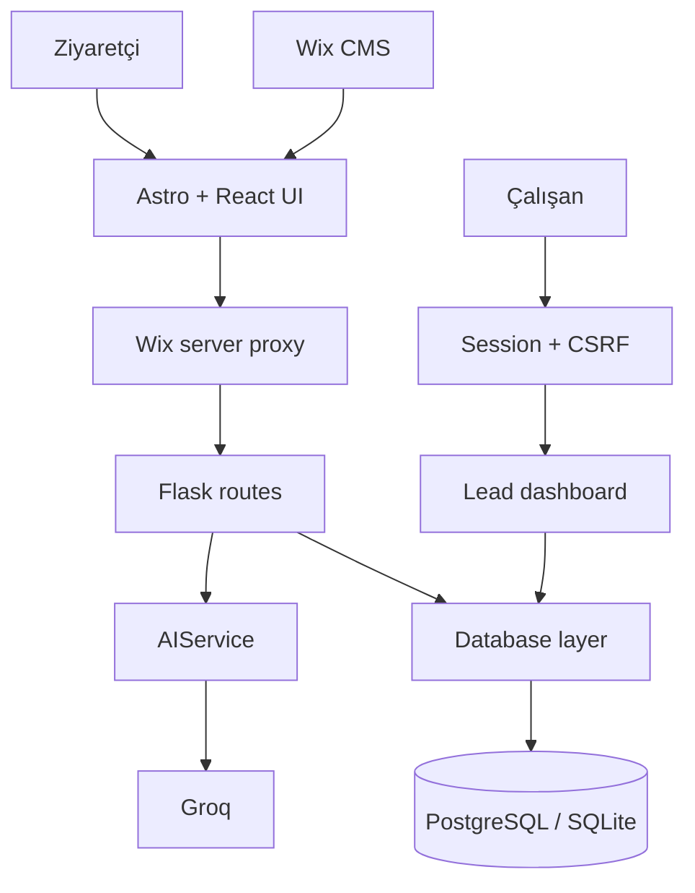

# Sistem Mimarisi

## Amaç

AESIR AXIOM sistemi üç bağımsız sorumluluk alanına ayrılır:

1. Wix üzerinde sunulan kurumsal frontend ve yönetilebilir CMS içeriği.
2. Render üzerinde çalışan Flask iş mantığı.
3. Groq ve PostgreSQL/SQLite dış servis katmanı.

## Sınırlar

| Katman | Sorumluluk | Bilmemesi gereken |
|---|---|---|
| Astro sayfaları | İçerik, semantik HTML, SEO | Groq anahtarı, SQL |
| Wix CMS | Marka, bölüm, tekrar eden içerik ve SEO kayıtları | React durumu, backend iş mantığı |
| React bileşenleri | Chat/form durumu ve erişilebilir etkileşim | Backend URL’si, veritabanı |
| Wix API proxy | Girdi doğrulama, timeout, güvenli yönlendirme | AI sağlayıcı ayrıntısı, SQL |
| Flask routes | HTTP sözleşmesi ve servis koordinasyonu | SQL uygulaması, Groq HTTP çağrısı |
| AIService | Sistem bağlamı ve AI sağlayıcı çağrısı | Flask template, veritabanı |
| Database | Lead kalıcılığı ve sorgular | HTTP, UI, AI |

## Neden proxy kullanılıyor?

- Render servis adresi tarayıcı kodunda sabitlenmez.
- CORS yüzeyi küçülür.
- İstek boyutu ve geçmiş mesaj sayısı frontend sunucusunda sınırlandırılır.
- Backend kesintisi TR/EN güvenli hata mesajına çevrilir.
- Sağlayıcı değişirse React arayüzü değiştirilmez.

## Dağıtım

- Wix: SSR Astro frontend, CDN ve Wix servis entegrasyonları.
- Render: Gunicorn ile Flask uygulaması.
- PostgreSQL: üretim lead verisi.
- SQLite: yerel geliştirme ve izole test.
- GitHub: kaynak kodu ve değişiklik geçmişi.

CMS modeli, koleksiyon alanları ve fallback davranışı için
[`CMS.md`](CMS.md) belgesine bakın.
